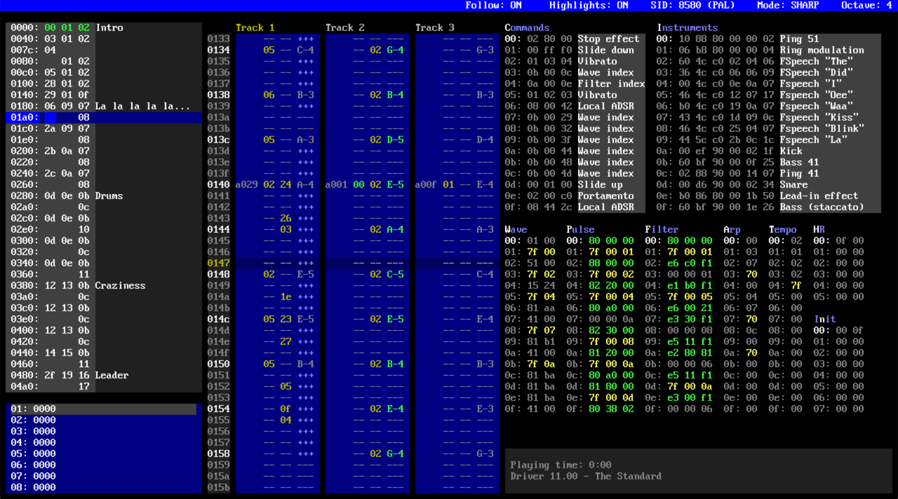

# SID Factory II

SID Factory II is a cross-platform editor for composing music that will work on
a Commodore 64. It uses the reSID emulator and is currently in open BETA. You
can download binary release builds from [here](http://blog.chordian.net/sf2/).
To build from source, have a look [here](DEVELOPMENT.md).

Main programming by Thomas Egeskov Petersen, with assistance by Jens-Christian
Huus and Michel de Bree.

Notable features:

- Uses the renowned reSID emulator
- Tracker-like interface, using JCH's contiguous sequence stacking system and
  Protracker note input layout.
- Choice of various music drivers made by pioneer musicians
  [Laxity](https://deepsid.chordian.net/?file=/MUSICIANS/L/Laxity) and
  [JCH](https://deepsid.chordian.net/?file=/MUSICIANS/J/JCH) ,
  optimized for use in demos and games on the Commodore 64.
- A hotkey opens a surrounding overlay with help for both editor and driver.
- Imports Goattracker, CheeseCutter and MOD files.
- Supports both SID models 6581 and 8580 for PAL and NTSC.
- Unlimited undo
- Multiple songs
- Copy / paste and modify selected area
- Built-in packer and relocator to position the music anywhere in the Commodore
  64 memory. Relocate used zero page addresses.
- Includes demo tunes to learn from.
- Cross platform: Windows, macOS (Intel and ARM) and Linux versions.
- Configurable settings, shortcuts and keyboard layout
- Open source

## Changelog

Please report issues in our [issue tracker](https://github.com/Chordian/sidfactory2/issues).

### Next release

- Added [#190](https://github.com/Chordian/sidfactory2/issues/190)
  Configuration options
  for setting the limits of rastertime usage used to color frames orange or red in
  the flightrecorder.
  `Visualizer.CPU.Medium.Rasterlines` and `Visualizer.CPU.High.Rasterlines`

### Build 20231002

- Added: [#102](https://github.com/Chordian/sidfactory2/issues/102) Visualizers
  for pulse width (per channel), filter cutoff and an indication per channel if
  it is being filtered.
- Added: Config option `Visualizer.PulseWidth.Style` to set the default style
  for the pulse width visualizer.
- Changed: New default driver is 11.05.00
- Added: [#156](https://github.com/Chordian/sidfactory2/issues/156)
  Configuration option `Disk.Hide.Extensions` to hide files with certain
  extensions in the file browser. Default values are `.sid`, `.wav` and `.mp3`
- Changed: Configuration parameter `Window.Scale` now has a range from 1.0 to
  10.0, so users can blow up the screen even bigger. Values below 1.0 were not
  working correctly.

### Build 20221007

- Fixed: [#162](https://github.com/Chordian/sidfactory2/issues/162) Crash when
  converting NP20 and GT tunes.
- Fixed: Crash when using a loop point beyond position 128
- Fixed: [#161](https://github.com/Chordian/sidfactory2/pull/161) A bug where
  sometimes you couldn't edit sequences before hitting the play button.

### Build 20220914

- Added: [#37](https://github.com/Chordian/sidfactory2/issues/37) Multi song
  support. Allows you to edit multiple order lists that share the same sequences
  and sounds. Press `F7` to check it out.
- Added: Marking and copy/paste functionality in the song list
- Added: Marking and copy/paste inside sequences (even across boundaries)
- Added: [#74](https://github.com/Chordian/sidfactory2/issues/74) Configurable
  virtual piano keyboard layout. (Thanks to Wolfgang Kreutz for requesting)
- Added: [#119](https://github.com/Chordian/sidfactory2/issues/119) A song can
  be made to stop playing instead of looping.
- Added: An option to set the emulation sample rate to a user defined value
  (Thanks to Tammo Hinrichs for implementing)
- Added: More than 30+ new source tunes by JCH and Vincenzo
- Fixed: Scrolling in the song list using the mouse wheel
- Fixed: reSID won't output a click anymore when launching SID Factory II or
  loading/saving files (Thanks to Tammo Hinrichs for implementing)

### Build 20211230

- Added: You can now add labels for song list rows. Left-click to edit a label.
- Added: Note delay; delay a note by 0-F ticks. This is a feature of the new
  default driver 11.04
- Added: An option in the packer to specify the base for zero page addresses
  that the player uses.
- Added: Documentation on how to customize configuration using a `user.ini`
  file. Including a default template in `/documentation/user.default.ini`.
- Added: Configuration options:
  - `Window.Scaling` to scale the contents of the window. (Thanks to Matty
    Seito for suggesting)
  - `Editor.Driver.Default` to set the default driver that is loaded when
    starting up the editor.
  - `Editor.Confirm.QuickSave` to enable/disable confirmation dialog on quick
    save.
  - `Sound.Output.Gain` for boosting/lowering output volume of the editor.
  - `Disk.UserFolders` and `Disk.UserFolders.Aliases` to add your favorite
    folder shortcuts to the file browser.
  - `Disk.Startup.Folder` to set the default startup folder for the file
    browser.
  - `Editor.Follow.Play` to set default follow play on/off.
  - `Editor.Sequence.Highlights` to set default sequence highlights on/off.
  - `Sound.Emulation.8580.FilterCurve` for adjusting the filter of the 8580 model.
  - `Sound.Emulation.6581.FilterCurve` for adjusting the filter of the 6581 model.
  - `Sound.Emulation.Default.Model` to set the default SID model (6581/8580) on
    startup.
  - `Sound.Emulation.Default.Region` to set default region (PAL/NTSC) on
    startup.
- Changed: [#142](https://github.com/Chordian/sidfactory2/issues/142) the
  list of keycodes that can be used for remapping is complete now. Please note: the names for
  keycodes starting with `num` are renamed to start with `kp_`.
- Changed: `macOs` [#146](https://github.com/Chordian/sidfactory2/issues/146) the
  official macOS distribution is now a universal application, meaning it will
  run native both on the new M1 (arm64) and the Intel (x86_64) architecture.
  The architecture the application is running on is reflected in the build
  number in the lower right corner of the startup screen.
- Fixed: More accurate clockspeed (Thanks to Lazlo Vincenzo Vincze for
  reporting)
- Fixed: `macOs` [#131](https://github.com/Chordian/sidfactory2/issues/131) SF2 won't
  compile on mac with Silicon M1 CPU. (Thanks to Rolf Greven for reporting and
  suggesting the fix)
- Fixed: `linux` [#133](https://github.com/Chordian/sidfactory2/issues/133) Emulation
  error when starting up linux version. (Thanks to Maurizio Dall'Acqua for
  reporting)
- Fixed: `linux` [#134](https://github.com/Chordian/sidfactory2/issues/134) SF2 won't
  compile on Arch Linux (Thanks to jansalleine for reporting and suggesting the
  fix)
- Fixed: [#137](https://github.com/Chordian/sidfactory2/issues/137) Instability
  in filter table when jumping to set command in default driver.

### Build 20210104

#### Editor

- Added: The converter has now been embedded into the editor; just load MOD, SNG or CT directly
- Added: Converting from MOD will show a dialog for choosing which of the four channels to ignore
- Added: **Ctrl-Shift-F** for inserting the first _empty_ unused sequence
- Added: **Ctrl-D** for duplicating and replacing the currently edited sequence
- Added: **Ctrl-Shift-D** for duplicating and appending sequence after the currently edited sequence
- Changed: Splitting a sequence with **Ctrl-B** now splits to the first _empty_ unused sequence
- Changed: `macOS` Copy/Paste/Undo/Redo are now under the standard macOS key combinations
  (**Cmd-C**, **Cmd-V**, **Cmd-Z**, **Shift-Cmd-Z**) (Thanks to Bastiaan Winde for reporting)
- Fixed: [#91](https://github.com/Chordian/sidfactory2/issues/91) cannot edit
  tracks anymore after dialog has been shown. (Thanks to Arjen Bokhoven for
  reporting)
- Fixed: `macOS` [#71](https://github.com/Chordian/sidfactory2/issues/71) switch instrument/command while in a table (Thanks to Adam Davidovics
  for reporting)
- Fixed: `macOS` [#67](https://github.com/Chordian/sidfactory2/issues/67) crash when run from a path with spaces
  (Thanks to Arjen
  Bokhoven for reporting)

#### Drivers

- Driver update 11.03 adds a filter enable flag bit in the instruments

#### Converter

- The standalone converter has been removed due to the converter nowing being embedded into the editor

### Build 20200911

#### Editor

- The overlay can now be shown inside the editor with **F12** and also changes depending on what driver is loaded
- Added **Ctrl+L** for setting a song loop position (the order list words will turn green in that spot)
- It is now possible to delete a file in all file dialogues by hitting the appropriate key
- Seven new color schemes have been created in addition to the default one
- The importer now also carries over auxiliary data (e.g. table descriptions)
- Upgraded the ReSID emulation (resid-fp) to the latest version
- Fixed `..` erroneously interpreted as a file to be opened instead of browsing back
- Fixed tracks not unmuted properly after muting them and then loading a different `.sf2` file
- Fixed the editor crashing when trying to optimize a song with no sequence data
- Fixed not being able to properly play from a bookmark when showing tracks of uneven lengths
- `macOS` Now using **Minus** and **Shift+Minus** for fast/faster forward
- `macOS` Instrument up/down is now **Cmd+Up/Down** while Command up/down is now **Shift+Cmd+Up/Down**
- `macOS` You can now open `.sf2` files with SID Factory II directly from Finder (Open With)
- `macOS` Backward compatible until macOS 10.9 (Mavericks)

#### Drivers

- Driver update 11.02 adds commands for pulse program index, tempo change, and main volume

#### Converter

- Added a third conversion option for handling `.ct` source tunes from CheeseCutter
- The SNG and CT converters now support the pulse index and main volume commands in driver 11.02
- The MOD, SNG and CT converters now support then tempo change command added in driver 11.02
- Command description labels are now created by the MOD and SNG converters too

#### Documentation

- Expanded the user manual with a table of contents, chapters about the data tables, and various pictures
- The `notes.txt` file has been overhauled to show a complete list of all default keys for both Windows and macOS
- The text files for all of the drivers have been polished to be easier to read at a glance

#### Other

- The PowerShell script for the bright overlay is now deprecated and will no longer be included
- The area previously known as the _gray order list_ is now called the _song list_ instead

### Build 20200718

- Added a dialog box message for when saving fails
- Added a dialog box message for when selecting a folder fails
- `macOS` Fixed crash bug when trying to open a folder you had declined from a system dialog
- `macOS` Editor ran without SDL2 being installed; added latest version of SDL2 to the package
- Fixed crashing when trying to display unknown characters (usually in the file menu)
- Fixed note preview using **Caps Lock** not working
- Fixed note preview sometimes behaving inconsistently
- Fixed left/right "blindness" in user manual

### Build 20200716

- Added description labels in the command and instrument tables
- All drivers have been updated with meta data for the new descriptions capability
- Also updated all the demo songs with command and instrument descriptions
- Updated the converter to copy instrument descriptions from GT2 and MOD files
- Changed hotkey for bit editing in tables to **Shift+Enter** because of descriptions now using the **Enter** key
- Improved the table layout handling to allow for vertically tiled tables
- All tables can now be accessed with an **Alt+[letter]** hotkey (the letter is highlighted in the table name)
- A separate macOS build has been released for the first time (maintained by Michel de Bree)
- Added the **Ctrl+U** hotkey for toggling between lower and upper case letters for all hexadecimal values
- You can now drag-and-drop an `.sf2` source file directly into the editor
- Added an exit application confirmation dialog
- All file lists now include a `..` line for browsing back to the parent folder
- Upgraded the ReSID emulation (resid-fp)
- Changed the application caption text (filename now comes first)
- Debug functionality added for examining ReSID output
- Fixed a threading issue that could cause instability in the ReSID emulation
- Fixed inserting/deleting rows in sequences not immediately being reflected in the order list overview

### Build 20200610

- Updated fast forward: **½** = 4x update, **Shift+½** = super fast update
- Added **Ctrl+I** during sequence editing for inserting the current selected instrument value. If a value is already set, it will be cleared
- Added **Ctrl+O** during sequence editing for inserting the current selected command value. If a value is already set, it will be cleared
- Added **Ctrl+Space** during table editing (if keyplay mode is on) - will play like **Space** alone but apply the current highlighted command, regardless of which table is in focus
- In the marker view, **Enter** (or left-click) will move the current track position to that of the marker. **Ctrl+Enter** (or double-click) will do the same and then start playback
- Reversed the direction of the CPU usage graph
- Added command-line parsing, so that it is possible to associate `.sf2` files with the editor and open them in File Explorer
- Added **NumPad+Plus** and **NumPad+Minus** for incrementing and decrementing the currently selected index of the instrument table
- Added **Ctrl+NumPad+Plus** and **Ctrl+NumPad+Minus** for incrementing and decrementing the currently selected index of the command table

### Build 20200603

#### Drivers

- Fixed the meta data for command action keys (jump to relevant tables on **Ctrl+Enter**) in all variants of driver 11

#### Editor

- Fixed import strings to say import music data and dialog box to reflect the same too
- Fixed importer assertion when trying to import an empty project (i.e. a driver)
- Fixed **Ctrl+V** (paste) not notifying the order list overview
- Editing octave down/up has been moved to **F3** and **F4**, transpose current sequence one semi-tone down/up has been moved to **Shift+F3** and **Shift+F4**, and transpose current sequence one octave down/up has been moved to **Ctrl+F3** and **Ctrl+F4**
- Added fast forward on the **½** key
- Fixed a bug in directory enumeration that would cause a crash when trying to access some system files

### Build 20200528

#### Editor

- Added automatic update of build data which is printed in right bottom of the splash screen
- Added PNG support and a temporary embedded logo
- Pressing **End** in a table will set the row of the last occurrence of a zero-only row found from the bottom and upwards
- OrderlistOverview: Added **Ctrl+Enter** to move to and start playing from position
- OrderlistOverview: Mouse left-click will select and move tracks view to position
- OrderlistOverview: Mouse double-click will select and move tracks view to position and start playing from position
- OrderlistOverview: Implemented **Page Up** and **Page Down** (skips 20 lines)
- OrderlistOverview: Added **Home** which goes to top visible then first index, and **End** which goes to last visible then last index
- Tracks and order list focus: Fixed issue where cursor position would be misaligned when focusing on order list entry and pressing **Ctrl+G**
- Changed **Shift+F2** to play from the event position of the top current sequence of the track in focus (or last in focus)
- Added **Space** during table edit for previewing the last note played with **Shift+[note]** value (this will do nothing if not already in "play through input" mode)

---

Changes to earlier versions are not available.
