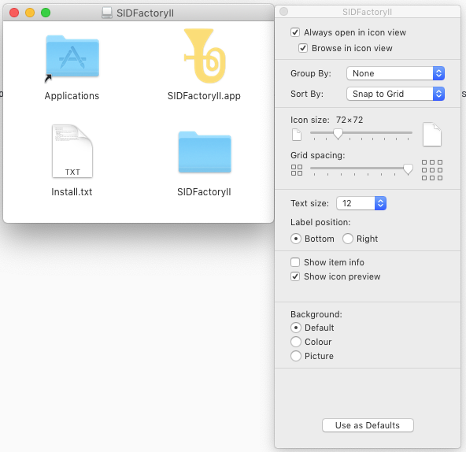

# SIDFactoryII macOs build

Building macOS distribution from command line (iTerm)

## Prerequisites

- [Homebrew](https://brew.sh)
- Xcode with command line tools
- `brew install librsvg pandoc`
- Maybe `brew install gnu-sed awk grep`
  Not sure which are standard on macOS

## Targets

- `make`: Create just the executable
- `make app`: Create the `SIDFactoryII.app`
- `make tmp`: Create a temporary DMG image
- `make dmg`: Finalize existing temporary DMG image

## Create a distribution

First commit all changes! (To make sure the commit hash used in the application
version is correct)

Checkout `sf2converter` alongside `sidfactory2`, so that both projects are in
the same root folder.

### Build `SF2converter`

This creates the `SF2Converter` binary in `macos/artifacts`

From `sf2converter/macos`:

```sh
make clean && make
```

### Build `SIDfactoryII`

This creates a DMG image that is ready for distribution, except that the window
not nicely layed out when you open it, and it isn't compressed. The created
image is `macos/artifacts/tmp.dmg`

From `sidfactory2/macos`:

```sh
make clean && make tmp
```

### Layout the DMG



Manually for now

- Mount the `tmp.dmg`
- Open the DMG in finder
- Close other tabs if any
- View -> As Icons
- View -> Sort by -> None
- View -> Show view options
- View options:
  - Always open in icon view
  - Icon size: 72x72
  - Group by: None
  - Sort by: Snap to grid
- Put icons in this order:
  - Top left: `Applications`
  - Top right: `SIDFactoryII.App`
  - Bottom left: `Install.txt`
  - Bottom right: `SIDFactoriyII` (the folder)
- View -> Hide toolbar
- View -> Hide statusbar
- View -> Hide tabbar
- View -> Hide pathbar
- Scale the window nicely

### Make the final DMG

This will create `macos/artifacts/SIDFactoryII_macos_<date>.<revision>.dmg`,
ready for distribution.

Unmount the DMG (From another finder window, do not change the window with the
nicely laid out DMG!)

`make dmg`
